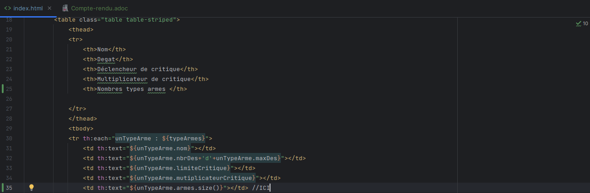
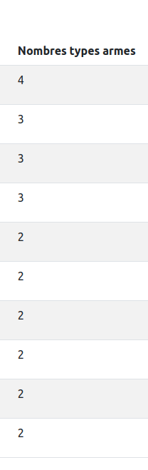
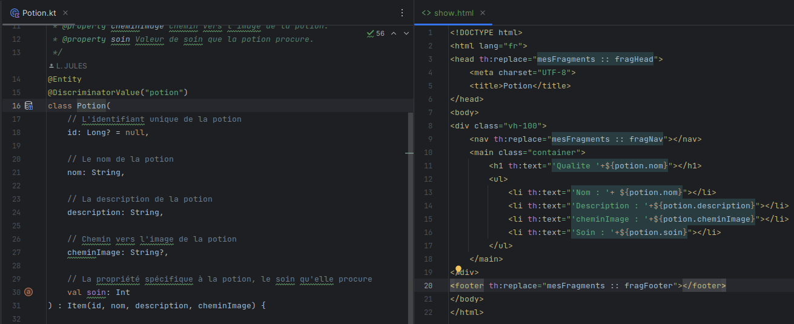
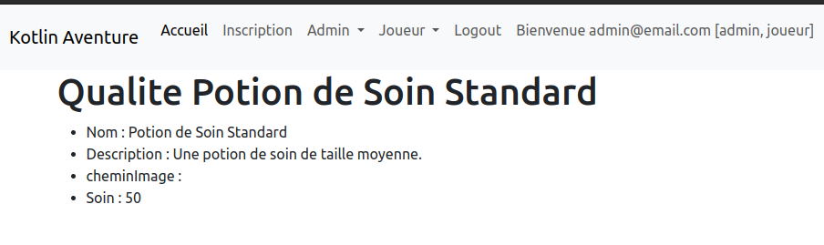
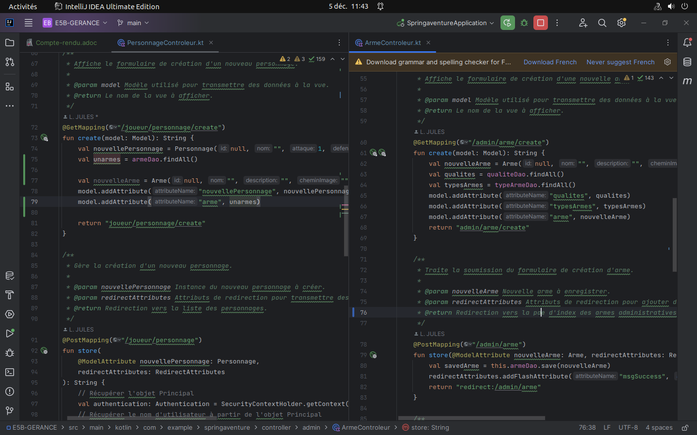
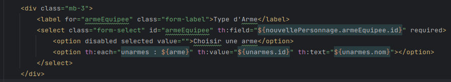
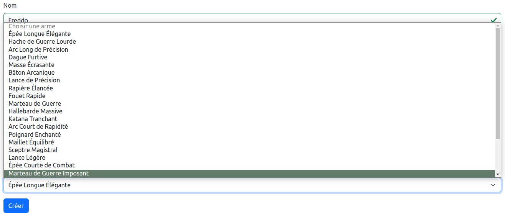

Compte rendu épreuve E5 :

== A/ Dans le tableau des «types d’armes» faire apparaître dans une colonne sur le « nombre d’armes» qui correspond à chaque ce type.

J’ai inserer dans le tableau de type d'arme une nouvelle colonne:

**
<td th:text="${unTypeArme.armes.size()}"></td>
**

Ce qui nous donne :

== B/Faire en sorte de pouvoir afficher sur une nouvelle page le détail de potion.

J’ai créer une nouvelle page HTML dans les templetes (celui du dossier potion) que j’ai appeler show.html, j’ai ensuite copier-coller le show.html du dossier qualité et insérer les attributs dédiés à qualité en reprenant l’entity de potion :

Ce qui nous donne :

== C/On souhaite que lors de la création d'un personnage (endpoint du formulaire : /joueur/personnage/create) faire en sorte que le joueur puisse choisir une arme parmi la liste de toute les armes.

J'ai copier-coller la partie @GetMapping("/admin/arme/create") du controller Arme pour le controller de personnage puis associer les models et attribus dont j'avais besoin :

Et enfin j'ai ajouter un select/champs dans le create.html qui donnent la possilibité de choisir une arme à équiper :

Ce qui nous donne :

